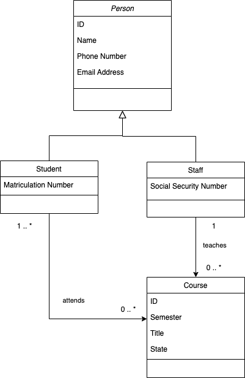

# Studentevidence

### Requirements
* If you haven't installed an IDE yet, install Intellij IDEA (https://www.jetbrains.com/de-de/idea/download/) or Eclipse (https://www.eclipse.org/downloads/), for example. We recommend to use IntelliJ Idea Community Edition.
* [Java JDK 17](https://www.oracle.com/java/technologies/javase/jdk17-archive-downloads.html)
* Maven (Intellij IDEA ships Maven in an appropriate version)
* git (Intellij IDEA ships git in an appropriate version)

### Checkout project from git and first start up
```console
> git clone https://gitlab.aau.at/zid-swdev-public/studentevidence.git
```
* use your student account (username / password) to clone the project
* if you have troubles cloning the project, you can also download it as a zip file. Just use the Download button (between the Web IDE button and the Clone button)
* open the project with your IDE
* build and start the project within your IDE
* after a successful start up process you should be able to access the application under http://localhost:8080


### Task
Implement a simple web application with spring boot and spring web mvc to manage students, staff and courses (lectures). 
Students, employees (staff) and courses should be able to be saved and deleted in an in-memory storage via a web form.
In addition, it should be possible to add participants (students) and exactly one teacher (staff) to a course.
The goal is an overview page of courses with course title, semester, state and teacher. In the detail view you should see the course participants.

We have already given a few classes for guidance. Feel free to alter this structure at your own discretion.



The class diagram describes the necessary entities of the application. 
The "State" field in the Course entity should represent the two states "ACTIVE" and "INACTIVE".

If you want to keep the given structure, here are a few tips:

* derive a class Student from the abstract class Person in the domain package
* derive a class Staff from the abstract class Person in the domain package
* implement all classes in the domain package
* implement the InMemory-Repository components in the persistence package
* implement a PersonService and a CourseService in the services package. This services should handle your business logic
* implement all necessary Controllers in the controller package. We propose to create a StudentsController, a StaffController and a CoursesController
* implement the necessary views as html in /resources/templates. 

The project is set up with Thymeleaf which is very easy to use (see reference at the bottom of the page).
However, you are free to use any other technology and CSS framework of your choice.

### Guides
The following guides illustrate how to use some features concretely:

* [Serving Web Content with Spring MVC](https://spring.io/guides/gs/serving-web-content/)
* [Spring Boot CRUD Application](https://www.baeldung.com/spring-boot-crud-thymeleaf)

### Reference Documentation
For further reference, please consider the following sections:

* [Official Apache Maven documentation](https://maven.apache.org/guides/index.html)
* [Spring Web](https://docs.spring.io/spring-boot/docs/2.7.0/reference/htmlsingle/#boot-features-developing-web-applications)
* [Thymeleaf](https://www.thymeleaf.org/)
